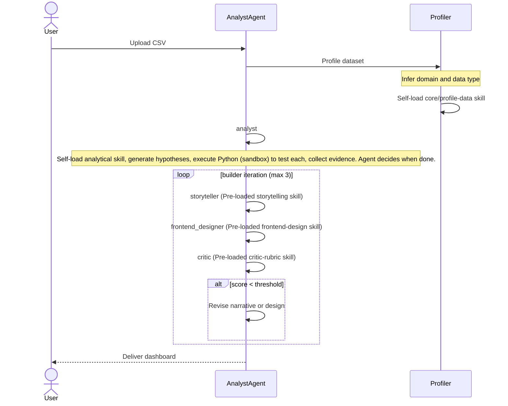
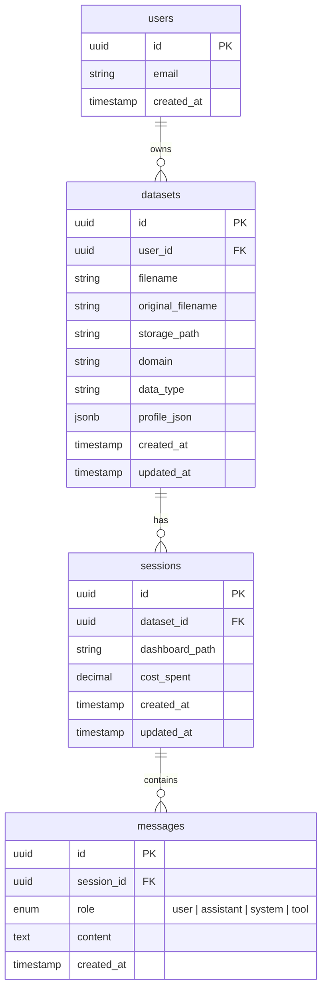
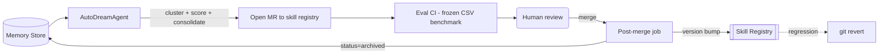
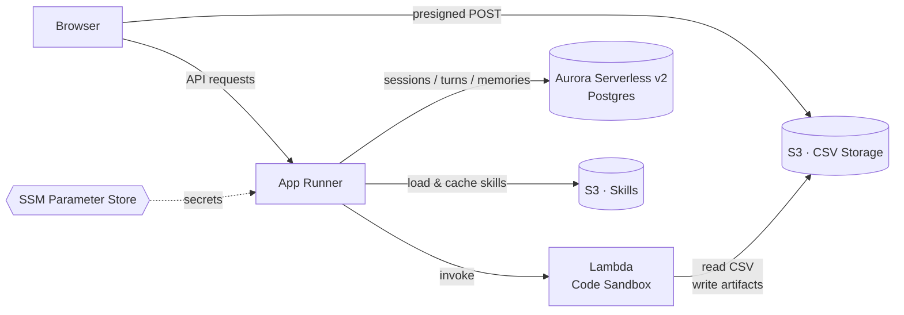
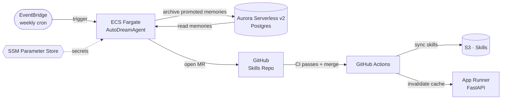

# Auto-Analyst – Design Specification

A self-improving agentic system for data analysis. The user uploads a CSV, an agent profiles it, loads the right analytical and domain skills, forms hypotheses, gathers evidence, and produces a storytelling dashboard. A critic agent gates the output. Domain knowledge accumulates via memories and is periodically promoted into versioned skills.


## Objectives

* **End-to-end analysis:** CSV → hypotheses → evidence → storytelling dashboard.
* **Self-improving:** domain knowledge from past sessions loads into future ones.
* **Reviewable:** promoted knowledge is auditable, versioned, rollback-able.


## API Contract

| Endpoint | Method | Description |
|---|---|---|
| `/datasets` | `POST` | Upload CSV. Creates dataset, runs profiler. Returns `dataset_id`. |
| `/datasets` | `GET` | List user's datasets with profile metadata. |
| `/datasets/{id}/sessions` | `POST` | Create a chat session for a dataset. Returns `session_id`; analysis starts asynchronously. |
| `/sessions/{id}` | `GET` | Get session status + latest dashboard HTML if ready. |
| `/sessions/{id}/chat` | `POST` | Follow-up question. Appends to conversation, re-runs relevant graph nodes. |


### Runtime Flow




## Skill Registry

Skills are stored in a separate repository for more flexible access control, allowing users to submit MR without affecting the core agent capabilities.

Three types of skills:

| Scope | Purpose |
| --- | --- |
| `core/*` | Core skills powering the agent to perform profiling, storytelling, frontend design, critic rubric, web search, memory capture etc. |
| `analytical/*` | Guide on analysing different types of data e.g. time series, text, tabular, etc. |
| `domain-knowledge/*` | Domain knowledge for understanding dataset, nuances in the data, etc.|

```
skills/
  core/
    profile-data/SKILL.md
    storytelling-dashboard/SKILL.md
    frontend-design/SKILL.md
    critic-rubric/SKILL.md
    web-search/SKILL.md
    capture-memories/SKILL.md
  analytical/
    time-series/SKILL.md
    tabular-eda/SKILL.md
    free-text/SKILL.md
    panel/SKILL.md
    event-log/SKILL.md
    cohort/SKILL.md
  domain-knowledge/
    finance/SKILL.md
    ops/SKILL.md
    growth/SKILL.md
    hr/SKILL.md
```

## Database Model




## Observability & Cost Controls

- **Structured logging:** `structlog` JSON. Every node logs entry/exit with timing. Every LLM call logs model, tokens, cost.
- **Cost tracking:** Per-session spend accumulator. Hard-stop if max budget exceeded (configurable, default $1.00).
- **Tracing:** OpenTelemetry spans across FastAPI → LangGraph → LLM calls.
- **Metrics:** Prometheus counters for sessions, deliveries, errors by type, avg tokens/cost per session.

## Testing Strategy

| Layer | Approach |
|---|---|
| **Unit** | pytest. Skill file parsing, HTML rendering, graph nodes in isolation (mocked LLM). |
| **Integration** | Full graph end-to-end with frozen CSV fixtures + cached LLM responses. Assert expected HTML sections. |
| **Eval / Regression** | `tests/eval/` with frozen CSVs and expected dashboard attributes. Run on PRs. |
| **Cost guard** | Mock LLM client by default. Real calls only in eval, gated by env var. |


## Memory Model *(Future — not in MVP)*

Memories are domain-specific context not yet captured in skills. They are periodically promoted to skills via the self-improvement loop.

```yaml
id: mem_01HXYZ...
domain: finance
content: "..."
created_at: timestamp
status: active | inactive
```


## Self-Improvement Loop *(Future — not in MVP)*



1. **Scheduled job:** AutoDreamAgent clusters domain memories → opens MR listing `source_memory_ids`.
2. **Eval CI:** runs frozen benchmark on MR diff, posts delta.
3. **Post-merge job:** archives promoted memory IDs.

Rollback = git revert. Archived memories stay archived.


## AWS Architecture *(Future — not in MVP)*

**Main app**



**Self-improvement loop**



- **App Runner** — hosts the FastAPI backend as a container
- **S3** — two purposes:
  - *CSV storage:* browser uploads directly via presigned POST
  - *Skills storage:* skill markdown files synced from the skills repo via GitHub Actions on merge. Backend caches skills in memory with a short TTL; a post-merge webhook hits `/admin/invalidate-skills-cache` to force refresh. No redeployment needed on skill updates.
- **Aurora Serverless v2 (Postgres)** — Store datasets (metadata + profile), sessions, conversation turns, memories. Use to re-create prompt during follow-up questions.
- **Lambda (container image)** — sandboxed code execution
- **EventBridge Scheduler** — weekly cron that triggers the AutoDreamAgent as a one-off ECS Fargate task. Reads memories from RDS, clusters them, opens a GitHub MR to the skills repo.
- **SSM Parameter Store** — stores Anthropic API key, DB credentials, GitHub token. Free tier; no need for Secrets Manager at this scale.

## Open questions
- Should intermediate artifacts (dataframes, generated code, plotly figures) be persisted to disk to enable analytical follow-ups (e.g. "show me the raw data behind chart 3")? For MVP they are treated as transient agent working memory. Revisit post-MVP.