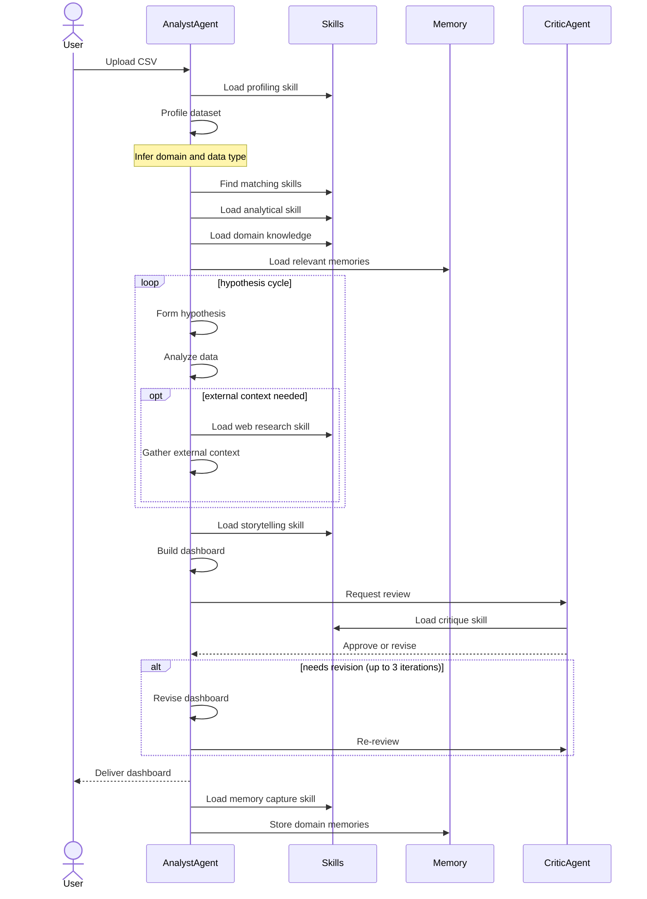
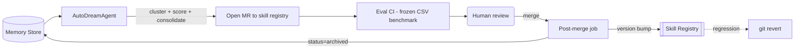

# Auto-Analyst – Design Specification

A self-improving agentic system for data analysis. The user uploads a CSV, an agent profiles it, loads the right analytical and domain skills, forms hypotheses, gathers evidence, and produces a storytelling dashboard. A critic agent gates the output. Domain knowledge accumulates via memories and is periodically promoted into versioned skills.


## Objectives

* **End-to-end analysis:** CSV $\rightarrow$ hypotheses $\rightarrow$ evidence $\rightarrow$ storytelling dashboard.
* **Self-improving:** domain knowledge from past sessions loads into future ones.
* **Reviewable:** promoted knowledge is auditable, versioned, rollback-able.


## Skill registry

Skills are stored in a separate repository for more flexible access control, allowing users to submit MR without affecting the core agent capabilities.

Three types of skills:

| Scope | Purpose |
| --- | --- |
| `core/*` | Core skills powering the agent to perform profiling the data, capturing memories, web search etc. |
| `analytical/*` | Guide on analysing different types of data e.g. time series, text, tabular, etc. |
| `domain-knowledge/*` | Domain knowledge for understanding dataset, nuances in the data, etc.|

```
skills/
  core/
    profile-data.md          # Deduces domain + type of data
    capture-memories.md      # when and what to write to memory
    web-search.md            # triggers: [benchmark, industry, external, news]
  analytical/
    time-series.md           # triggers: [date, timestamp, trend, seasonality, forecast]
    tabular-eda.md           # triggers: [numeric, distribution, correlation, aggregation]
    free-text.md             # triggers: [text, comment, review, sentiment, topic]
    storytelling-dashboard.md
  domain-knowledge/
    finance.md               # triggers: [revenue, margin, ar, ap, cogs, ...]
    ops.md
    growth.md

```


## Memory model

Memories are specific to domain knowledge only, providing additional context that aren't currently captured in skills. Memories will perodically be promoted to skills (see self-improvement loop)

```yaml
id: mem_01HXYZ...
domain: finance
content: "..."
created_at: timestamp
status: active | inactive

```


## Context layers

### System Prompt

- Agent identity 
- Skill Fontmatter 
- Skill index


### Start of Session - Loaded Once on CSV Upload

1. Skill to profile data $\rightarrow$ Deduce domain and type of data (Time series, Text, etc.)
2. Load the relevant analytical skill
3. Load the relevant domain knowledge
4. Load the memories for the particular domain

Tool calls and results from them are dropped from the context after initialisation to reduce context length.


### Conversation - Across turns in the same session

- Final agent responses including the hypotheses, evidence summaries, dashboard artifact

On follow-up questions, skills and memories are already in context – no reload.


## Runtime flow



Critic loop: max 3 iterations. Critic returns a concrete diff, not vague feedback. Aborts early if successive dashboards don't improve critic score delta.

---

## Self-improvement loop



1. **Scheduled job:** AutoDreamAgent clusters domain memories $\rightarrow$ opens MR. MR body lists `source_memory_ids`.
2. **Eval CI:** runs frozen benchmark on MR diff, posts delta as comment.
3. **Post-merge job:** parses MR body $\rightarrow$ archives promoted memory IDs.

Rollback = git revert. Archived memories stay archived; useful ones re-surface in future sessions.